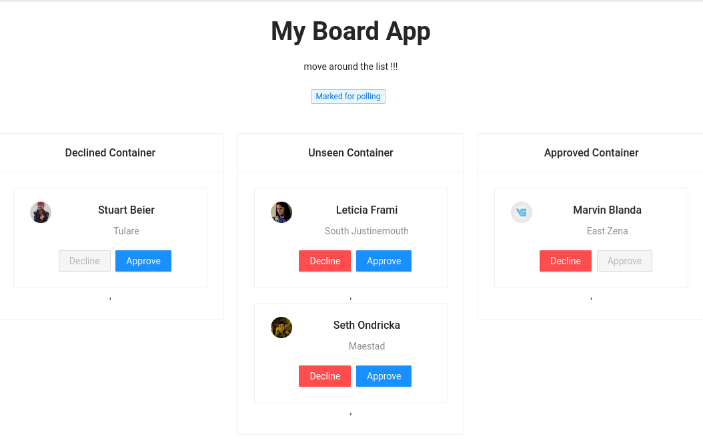
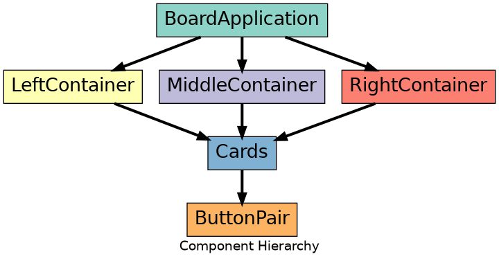

# boards

> Approve and Decline cards

## Tech Stack

| end      | Tech                    |
| -------- | ----------------------- |
| Frontend | react with hooks, axios |
| Backend  | nodejs, express, redis  |

## Integration

### Frontend ---> Backend

1. Fetch card data on initial load
2. Send updates to server on button clicks
3. auto view update via Pooling method

### Backend ---> Frontend

todo: ditch polling in favor of server push or webSocket ?

## How to run?

Backend

1. start redis-server on server `redis-server`
2. `cd backend; yarn install`
3. `node index.js` should start the backend service

Frontend

1. From root `cd frontend`
2. Install dependencies `yarn install`
3. `yarn start`

#### :v: Get in touch with me

> I am looking for Jobs ... :sunglasses:

- [Github](https://github.com/avimehenwal/)
- [My Website](https://avimehenwal.in)
- [My Blog v2](https://avimehenwal2.netlify.app/)
- [Twitter Handle](https://twitter.com/avimehenwal)
- [LinkedIn](https://in.linkedin.com/in/avimehenwal)
- [Stackoverflow](https://stackoverflow.com/users/1915935/avi-mehenwal)

Spread Love :hearts: and not :no_entry_sign: hatred 
